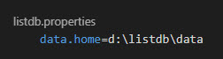

# ListDB (Currently in initial development)

### _A simple database for **small** data_

---

## Introduction

The goal of ListDB is to provide a lightweight database that executes CRUD operations on small lists. The first phase of the database is a simple command line interface. In the second phase, the project will be separated into a CLI and server.

## Other Versions

There are three implementations in progress: Rust, Crystal, Elixir and Ballerina. The purpose of the four implementations is to act as a comparison of the four languages to determine their suitability as a language for developing a database. Currently most work is being done in the Rust version with other languages being explored as time permits.

## Installation

A Windows executable will be available for download from the repository after Phase I is completed. The source can be downloaded and compiled with Rust (Cargo).
A "listdb.properties" file needs to be added to the same folder as the executable. This file contains the location of the data files for the database.

## Basic Usage

Lists of data are stored in topics. Basic CRUD operations can be performed.

## Currently Implemented Functions in CLI

### CREATE _\<type\> \<id\>_

**type** := The object type to be created. Currently only "TOPIC" is supported.  
**id** := a unique name for the object to be created.

Creates a new object with the specified name. Currently only support for topics is implemented.

### LIST _\<type\>_

Generates a list of topics

**type** := The object type to be listed. Currently only "TOPIC" is supported.

### STATUS

Displays a list of the current properties of the database.

### OPEN _\<target\> \<id\>_

### EXIT

---

### Next Items to be implemented

**Phase I**

- [x] Confirm Deletion
- [x] Update Record
- [ ] Add refresh topic function
- [ ] Add compact topic function

**Phase II**

- [ ] Use terminal for standard output
- [ ] Add fields to list
- [ ] Separate CLI and Server

**Phase IV+**

- [ ] Undo function for CLI
- [ ] Filter function
- [ ] Sort function
- [ ] Delete Topic function
- [ ] Compact Database function
- [ ] Audit Topic function
