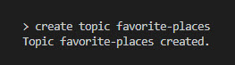

# ListDB (Currently in initial development)

### _A simple database for **small** data_

---

The goal of ListDB is to provide a lightweight database that executes CRUD operations on small lists. There are three implementations in progress: Rust, Crystal, and Ballerina. The purpose of the three implementations is to act as a comparison of the three languages to determine their suitability as a language for developing a database.

The first phase of the database is a simple command line interface. In the second phase, the project will be separated into a CLI and server.

## Basic Usage

Lists of data are stored in topics. Basic CRUD operations can be performed.

## Currently Implemented Functions in CLI

### CREATE _\<target\> \<id\>_

**target** := The object type to be created. Currently only "TOPIC" is supported.  
**id** := a unique name for the object to be created.

Creates a new object with the specified name. Currently only support for topics is implemented.

### LIST

### STATUS

### OPEN _\<target\> \<id\>_

### EXIT

---

### Next Items to be implemented

**Phase I**

- [x] Confirm Deletion
- [ ] Update Record
- [ ] Add refresh function
- [ ] Add compact function

**Phase II**

- [ ] Use terminal for standard output
- [ ] Add fields to list
- [ ] Separate CLI and Server
